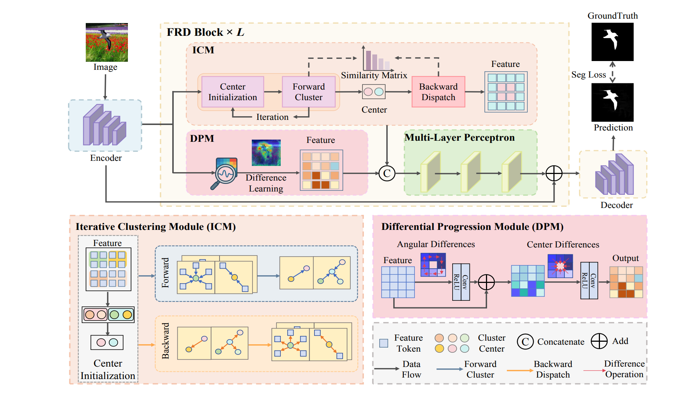
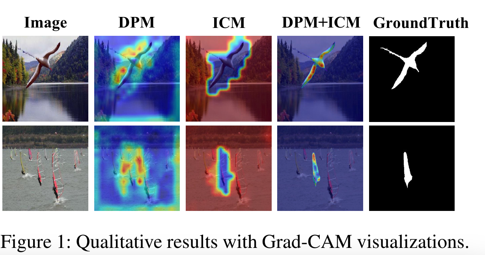

# AAAI 2026 – Amplifying Discrepancies: Exploiting Macro and Micro Inconsistencies for Image Manipulation Localization


This repository contains the code and configuration files used in our AAAI 2026 paper:

> **“Amplifying Discrepancies: Exploiting Macro and Micro Inconsistencies for Image Manipulation Localization”**


Our method, **FRD-Net**, is implemented on top of the **IMDL-BenCo** codebase, a comprehensive benchmark and framework for image manipulation detection and localization.




---

## 1. Repository Structure

At the top level:

- `IMDLBenCo/`  
  Core benchmark code (datasets, transforms, evaluation metrics, training utilities, model registry, etc.)

- `IMDLBenCo/modules/backbones/FRDNet.py`  
  Implementation of **FRD-Net**, our backbone that exploits macro and micro inconsistencies.

- `runs/`  
  Shell scripts for running the main experiments:
  - `demo_train_FRDNet.sh` – example script for training FRD-Net.
  - `demo_test_FRDNet.sh` – example script for evaluating a trained model on multiple benchmarks.

- `weights/`  
  Placeholder directory for saving / placing trained checkpoints used for evaluation.

- `balanced_dataset.json`, `balanced_dataset2.json`  
  Training dataset compositions (lists of IMDL-BenCo JSON datasets for supervised training).

- `test_datasets.json`  
  List of test sets (e.g. Columbia, COVER, CASIA, CocoGlide, NIST16) used to reproduce the main evaluation in the paper.

- `test_robust.py`, `test_rob.json`  
  Scripts and configuration for robustness evaluation under various perturbations.

- `train_val.py`, `train_valpar.py`  
  Training entry points built on IMDL-BenCo’s training framework.

- `test.py`  
  Evaluation entry point for multi-dataset testing using `test_datasets.json`.

- `requirements/`  
  Environment configuration:
  - `conda_requirements.txt`
  - `pip_requirement.txt`


---

## 2. Environment Setup

We recommend creating a **conda environment** (Python 3.8–3.10) and using a recent CUDA-enabled PyTorch.

```bash
# 1) Create and activate env (example)
conda create -n frdnet python=3.10
conda activate frdnet

# 2) Install dependencies (adjust according to your system)
# Option A: using conda_requirements.txt as reference
#   You can manually install key libraries from there.
# Option B: install pip requirements directly
pip install -r requirements/pip_requirement.txt


## 3. Data Preparation

IMDL-BenCo organizes datasets via JSON index files.
In this repository, the provided JSONs (e.g. `balanced_dataset.json`, `test_datasets.json`) contain **absolute paths** to our local datasets (e.g. `/disk/csh/IMDLBenCo/...`).

To run on your machine:

1. **Prepare datasets** used in the paper (e.g. CASIA v1/v2, IMD2020, FantasticReality, etc.) following the IMDL-BenCo format (JsonDataset / ManiDataset).
2. **Update the JSON files** so that each path points to your local directory structure.

   * `balanced_dataset.json`: training sets.(CAT-Net Split a portion of the training set as the validation set.)
   * `balanced_dataset2.json`: alternative training configuration.(IMDLBenCo Use the entire training set and test.)
   * `test_datasets.json`: evaluation sets for the main results.

3. Make sure the JSON format is unchanged; only modify the file paths.

For more details on dataset formats, please refer to the IMDL-BenCo documentation.

---

## 4. Training FRD-Net

The simplest way to start training is via the provided script:

```bash
bash runs/demo_train_FRDNet.sh
```

Before running, please edit `runs/demo_train_FRDNet.sh`:

* `CUDA_VISIBLE_DEVICES`: set to the GPUs available on your machine.
* `--pretrain_pth_path`: path to the backbone pre-trained weights (e.g. `mit_b2.pth`).
* `--data_path`: path to your **training composition JSON**, e.g. `./balanced_dataset.json`.
* `--test_data_path`: path to a validation/test dataset JSON (optional for validation during training).
* `--output_dir`, `--log_dir`: directories for checkpoints and TensorBoard logs.

The script internally runs:

```bash
torchrun \
  --standalone \
  --nnodes=1 \
  --nproc_per_node=2 \
  ./train_val.py \
    --model FRDNet_Main \
    --pretrain_pth_path <path_to_mit_b2.pth> \
    --world_size 1 \
    --batch_size 16 \
    --data_path <path_to_training_json> \
    --epochs 100 \
    --lr 5e-5 \
    --image_size 512 \
    --if_resizing \
    --min_lr 5e-7 \
    --weight_decay 0.05 \
    --edge_mask_width 7 \
    --output_dir <output_dir> \
    --log_dir <log_dir> \
    --accum_iter 1 \
    --seed 42 \
    --test_period 1 \
    --num_workers 8
```

You can adjust the batch size, learning rate, image size, and other hyperparameters according to your hardware.

---

## 5. Evaluation on Standard Benchmarks

After training, place your best checkpoint in `weights/` or another directory of your choice.

The provided evaluation script:

```bash
bash runs/demo_test_FRDNet.sh
```

This script calls:

```bash
torchrun \
  --standalone \
  --nnodes=1 \
  --nproc_per_node=1 \
  ./test.py \
    --model FRDNet_Main \
    --pretrain_pth_path <path_to_mit_b2.pth> \
    --world_size 1 \
    --edge_mask 7 \
    --test_data_json ./test_datasets.json \
    --checkpoint_path <path_to_checkpoint_dir> \
    --test_batch_size 1 \
    --image_size 512 \
    --if_resizing \
    --output_dir <output_dir> \
    --log_dir <log_dir>
```

* `test_datasets.json` defines multiple benchmarks (Columbia, COVER, CASIA, CocoGlide, NIST16, etc.).
* `checkpoint_path` should contain the `.pth` checkpoint saved by `train_val.py`.

The evaluation computes pixel-level and image-level metrics (e.g. Pixel F1, Pixel AUC, Image F1, IoU) consistent with the results in the paper.

---


## 6. Citation

If you find this code useful in your research, please cite our paper and the IMDL-BenCo benchmark (once the final bibliographic information is available).
A placeholder BibTeX entry for our AAAI 2026 paper:

```bibtex
@inproceedings{yourkey2026aaai_frdnet,
  title     = {Amplifying Discrepancies: Exploiting Macro and Micro Inconsistencies for Image Manipulation Localization},
  author    = {To be added},
  booktitle = {Proceedings of the AAAI Conference on Artificial Intelligence},
  year      = {2026}
}
```

And the IMDL-BenCo benchmark:

```bibtex
@misc{ma2024imdlbenco,
  title         = {IMDL-BenCo: A Comprehensive Benchmark and Codebase for Image Manipulation Detection \& Localization},
  author        = {Xiaochen Ma and Xuekang Zhu and Lei Su and Bo Du and Zhuohang Jiang and Bingkui Tong and Zeyu Lei and Xinyu Yang and Chi-Man Pun and Jiancheng Lv and Jizhe Zhou},
  year          = {2024},
  archivePrefix = {arXiv},
  primaryClass  = {cs.CV}
}
```


## 9. Contact

For questions about the code or experiments, please refer to the contact information provided in the main AAAI 2026 paper.

```
